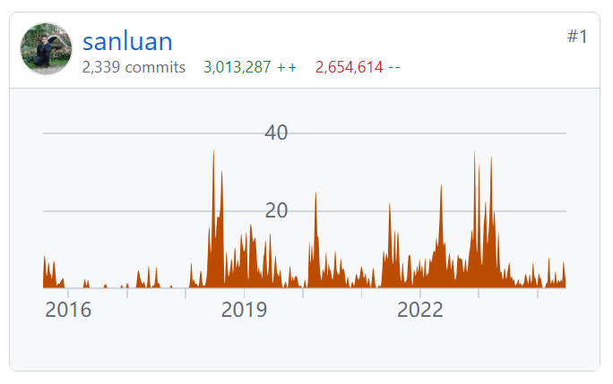
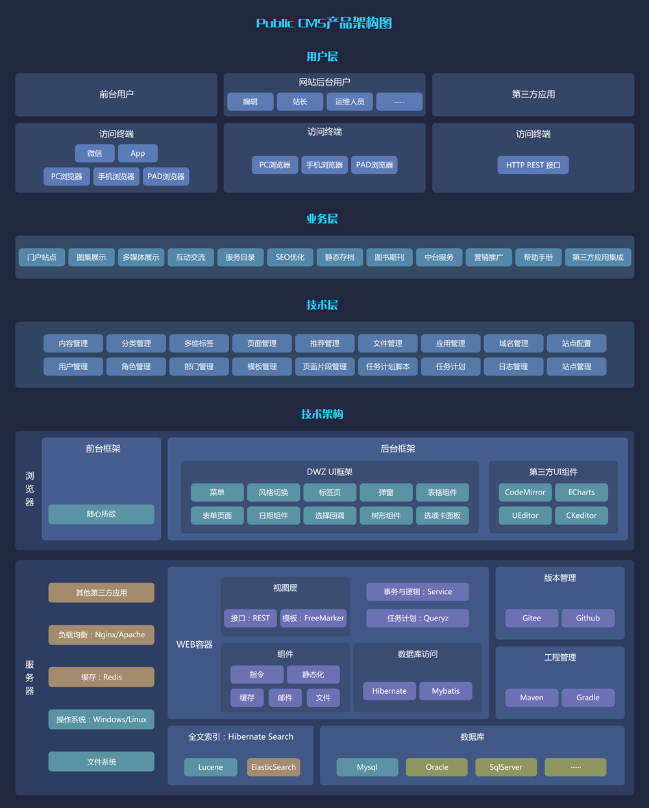
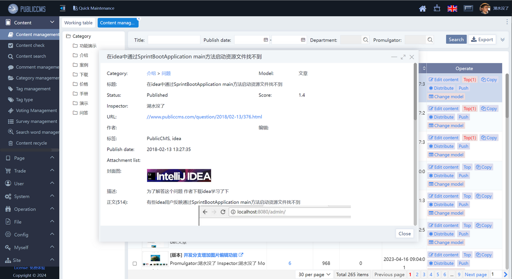
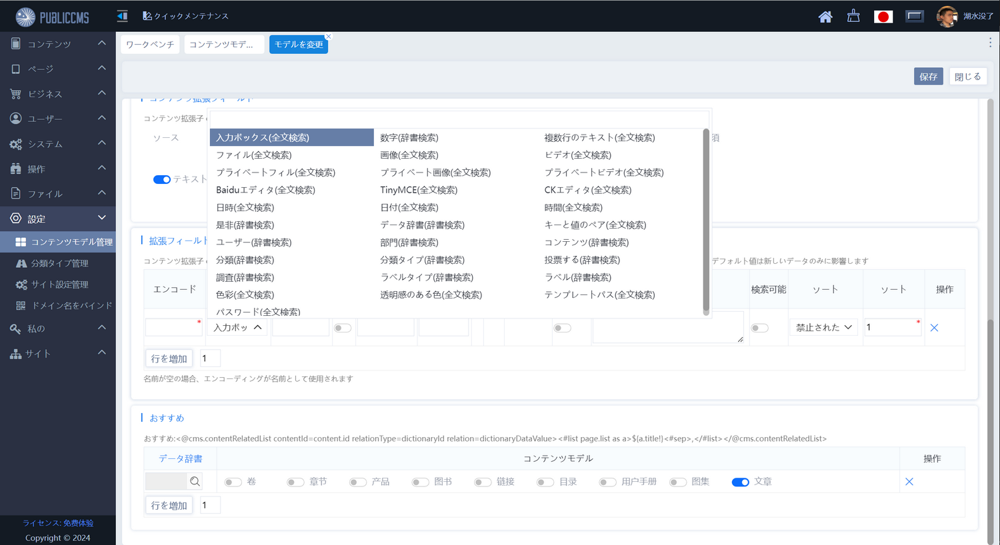
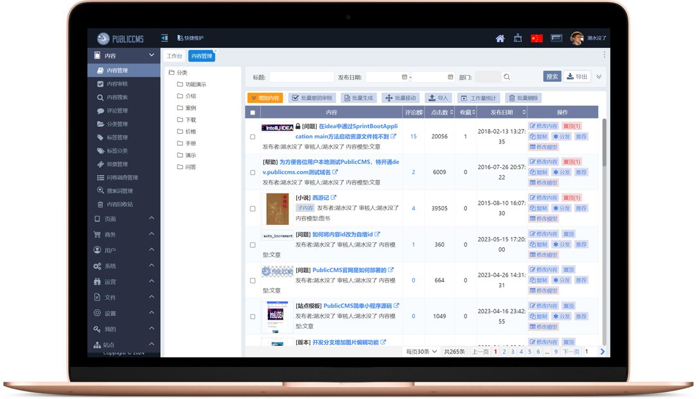
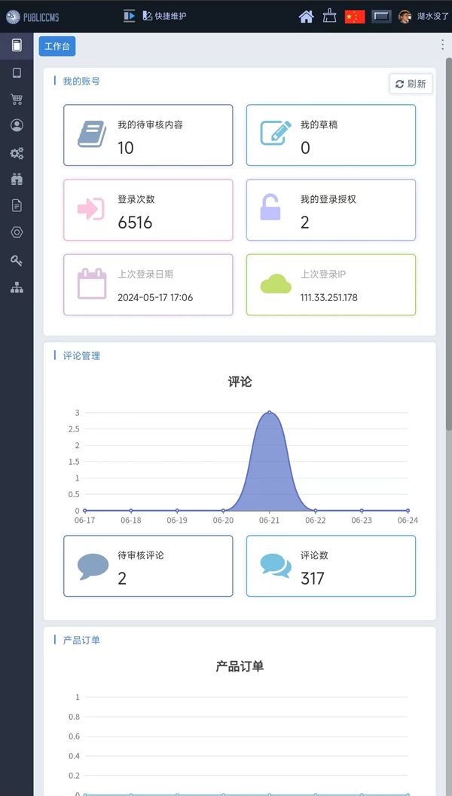

# PublicCMS

<p style="align:center">
  English | <a href="./README.zh-CN.md">简体中文</a>
</p>

<a target="_blank" href="https://qm.qq.com/q/uk0kyc8Sru">QQ Group 1</a> 191381542
<a target="_blank" href="https://qm.qq.com/q/em30nS0dsA">QQ Group 2</a> 481589563
<a target="_blank" href="https://qm.qq.com/q/estzM3VONM">QQ Group 3</a> 638756883
<a target="_blank" href="https://qm.qq.com/q/l26b2Z2R3i">QQ Group 4</a> 930992232

## Introduction

PublicCMS is an open source JAVACMS system developed with mainstream technologies in 2024. Developed by Tianjin Black Core Technology Co., LTD., the structure is scientific, easily support tens of millions of data, tens of millions of PV; Support visual editing, multi-dimensional expansion, full-text search, static site, SSI, dynamic page local static, URL rules completely customized for you to quickly build a site, large-scale site to provide a powerful drive, is also a good choice for enterprise project product prototype.

## Get the source code

https://gitee.com/sanluan/PublicCMS
https://github.com/sanluan/PublicCMS

## Participate in development

Switch to the develop,V5-develop branch and the free version to the V2021 branch


## Licensing agreement

* Version :V4.0,V5 Free for individuals and paid for enterprises: See LICENSE for details
* Version :V1.0,V2016,V2017,V2019,V2021 Completely free license agreement :MIT

## Environmental requirements

* V4.0 jdk or jre 1.8 and later,V5 Java17 and later
* mysql 5.5 and later

## Directory description

* data\publiccms	PublicCMS data directory
* doc			document
* publiccms-parent	project source code

## Fast compile and run

* Compile and run

Ensure that the operating system (OS) runs jdk

```
cd publiccms-parent
mvnw clean package
cd publiccms/target
java -jar -Dfile.encoding="UTF-8" -Dcms.filePath="../../../data/publiccms" publiccms.war
```
Visit the program page http://localhost:8080/ and follow the prompts to configure and initialize the database

Management background to visit relative paths for http://localhost:8080/admin/

* direct download an executable program (https://www.publiccms.com/download.html)

Prepare java and mysql environments locally, download executable programs, compress and decompress them, and run startup.bat or startup.sh

## Customize the operation mode

* windows startup command

```
java -jar -Dfile.encoding="UTF-8" -Dcms.port=8080 -Dcms.contextPath=/publiccms -Dcms.filePath="%cd%\data\publiccms" publiccms.war
```
* linux startup command

```
java -jar -Dfile.encoding="UTF-8" -Dcms.port=8080 -Dcms.contextPath=/publiccms -Dcms.filePath="`pwd`/data/publiccms" publiccms.war
```
For details about the parameters and their meanings, see the deployment manual

* Run in tomcat

Rename publiccms.war.original to publiccms.war or ROOT.war(the context path is /) and move the file to the tomcat webapps directory,The "-Dcms.filePath" parameter is still valid

* Run in docker

Execute:
```
docker run -d -p 8080:8080 sanluan/publiccms

```
Build your own image

Execute:

```
docker build -t mypubliccms .
docker run -d -p 8080:8080 mypubliccms

```
* Run in docker compose

Execute:
```
docker compose up -d

```
mysql host/port: mysql-cms/3306 ; database: publiccms ; user/password: publiccms/password!@#

More parameters, please refer to https://hub.docker.com/r/sanluan/publiccms/

## Demonstration

* the demo site : https://www.publiccms.com/
* the background demo : https://cms.publiccms.com/admin/ demo account/password test/test
* interface demo: https://cms.publiccms.com/interface.html


## Public CMS architecture diagram



## Public CMS Management - English



## Public CMS 管理バックグラウンド - 日本語



## Public CMS管理后台 - 中文



## Public CMS管理後臺 - 繁體


